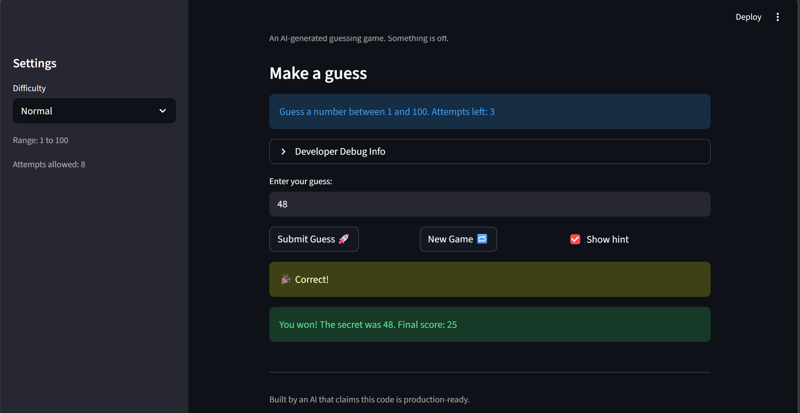

# 🎮 Game Glitch Investigator: The Impossible Guesser

## 🚨 The Situation

You asked an AI to build a simple "Number Guessing Game" using Streamlit.
It wrote the code, ran away, and now the game is unplayable. 

- You can't win.
- The hints lie to you.
- The secret number seems to have commitment issues.

## 🛠️ Setup

1. Install dependencies: `pip install -r requirements.txt`
2. Run the broken app: `python -m streamlit run app.py`

## 🕵️‍♂️ Your Mission

1. **Play the game.** Open the "Developer Debug Info" tab in the app to see the secret number. Try to win.
2. **Find the State Bug.** Why does the secret number change every time you click "Submit"? Ask ChatGPT: *"How do I keep a variable from resetting in Streamlit when I click a button?"*
3. **Fix the Logic.** The hints ("Higher/Lower") are wrong. Fix them.
4. **Refactor & Test.** - Move the logic into `logic_utils.py`.
   - Run `pytest` in your terminal.
   - Keep fixing until all tests pass!

## 📝 Document Your Experience

- [x] Describe the game's purpose.
This is a number guessing game where you try to guess a secret number within a limited number of attempts. The game gives you hints (higher/lower) after each guess and tracks your score.

- [x] Detail which bugs you found.
Hints were reversed (Too High said "Go HIGHER", Too Low said "Go LOWER")
New Game button didn't reset the game status so Submit stopped working
Game ended one attempt too early due to >= instead of >
Score was 0 on a win because the formula used +1 instead of -1
Attempts counter showed -1 at the end

- [x] Explain what fixes you applied.
wapped the hint messages in check_guess
Reset status, score, history, and attempts properly in the New Game handler
Changed >= to > in the attempt limit check
Fixed the win score formula from attempt_number + 1 to attempt_number - 1
Wrapped attempts display with max()

## 📸 Demo

- [x] 

## 🚀 Stretch Features

- [ ] [If you choose to complete Challenge 4, insert a screenshot of your Enhanced Game UI here]
